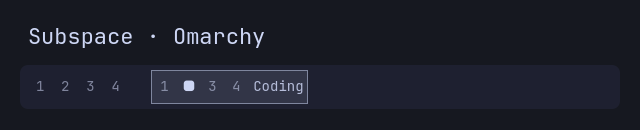

# Subspace for Omarchy

Named, numbered Hyprland window groups in the Omarchy Quattro bar.



*Illustrative preview rendered from the plugin with a four-window test group.*

A subspace is a native Hyprland window group: several windows sharing one tile,
with one visible at a time. Subspace puts that group's tabs and optional name in
the top bar. It does not create a second workspace system.

## Features

- Click a numbered tab to switch to that window. The active tab shows an indicator.
- Right-click any tab to name the focused group; click an existing name to rename it.
- Names follow the group's surviving windows when you move the group between
  workspaces, reorder tabs, or add/remove members.
- Theme-aware colors and a single rounded border around the tabs and name.
- Optional Alt-number selection, tab reordering, and rename shortcuts.
- All helpers ship inside the plugin. No personal dotfiles are needed.

The widget appears only while a grouped window is focused. Horizontal bars are
supported; the widget is hidden on vertical bars.

## Requirements

Omarchy **Quattro** with its Quickshell plugin system and Lua-configured Hyprland
(`hl.dsp.group.*` dispatchers), plus `python3`, `hyprctl`, and `omarchy-menu-input`.
The Python helpers use only the standard library. Older Waybar-based Omarchy
releases and older Hyprland dispatcher/config formats are not supported.

## Install

```sh
omarchy plugin add https://github.com/pietrovos/omarchy-subspace.git --enable
```

Choose the left bar section when prompted. You can move it later:

```sh
omarchy bar move pietrovos.subspace --section left
```

Place it next to the workspace widget using the bar layout controls if desired.
It works with the stock workspace widget; no custom workspace plugin is required.

## Use without installing shortcuts

Omarchy already provides:

| Action | Default shortcut |
| --- | --- |
| Toggle grouping | Super+G |
| Move a window out of a group | Super+Alt+G |
| Move a window into an adjacent group | Super+Alt+arrow |
| Next / previous grouped window | Super+Alt+Tab / Super+Alt+Shift+Tab |

Create a group using those controls, then left-click its tabs in the bar.
Right-click a tab to name it. Empty input clears the name; cancelling keeps it.
Click the displayed name to rename it.

**No additional keybindings are required for tab switching or naming.**

## Optional keyboard shortcuts

The optional setup adds:

| Action | Shortcut |
| --- | --- |
| Select window 1–10 | Alt+1 through Alt+0 |
| Move the active tab to position 1–10 | Alt+Shift+1 through Alt+Shift+0 |
| Next / previous window | Alt+mouse wheel down / up |
| Move the active window out of its group | Alt+G |
| Name the focused subspace | Super+Alt+N |

An absent tab position is a no-op. These shortcuts take precedence over existing
bindings on the same keys and may override application shortcuts such as Alt+1.
The original binding lines stay intact. Other Omarchy defaults continue to work.

Preview the proposed config before applying it:

```sh
python3 ~/.config/omarchy/plugins/pietrovos.subspace/scripts/setup-shortcuts.py --install --dry-run
```

Install explicitly:

```sh
python3 ~/.config/omarchy/plugins/pietrovos.subspace/scripts/setup-shortcuts.py --install
hyprctl reload
hyprctl configerrors
```

The setup backs up `~/.config/hypr/bindings.lua` and appends one marked loader block.
It is idempotent, does not change the bar/groupbar/layout config, and is never run
automatically by plugin installation. If your dotfiles use chezmoi, track the edit:

```sh
chezmoi add ~/.config/hypr/bindings.lua
```

For symlinked dotfiles, add this loader manually at the end of their source instead:

```lua
-- BEGIN pietrovos.subspace shortcuts
do
  local path = os.getenv("HOME") .. "/.config/omarchy/plugins/pietrovos.subspace/bindings.lua"
  local file = io.open(path, "r")
  if file then
    file:close()
    dofile(path)
  end
end
-- END pietrovos.subspace shortcuts
```

To customize shortcuts, remove the managed loader and add your preferred bindings
to your own config, using `bindings.lua` in this repository as a reference. Plugin
updates replace files inside the installed plugin directory.

## Optional appearance

Hyprland's built-in in-window groupbar stays enabled by default. If you prefer
only the top-bar tabs, add this to your own `~/.config/hypr/looknfeel.lua`:

```lua
hl.config({ group = { groupbar = { enabled = false } } })
```

Then run `hyprctl reload` and `hyprctl configerrors`. Remove that setting to restore
the default groupbar. This appearance change is separate from shortcut setup.

## Name storage and lifecycle

Names are stored in `$XDG_STATE_HOME/omarchy/subspace/groups.json`, or
`~/.local/state/omarchy/subspace/groups.json` when `XDG_STATE_HOME` is unset.
They survive shell restarts within the same Hyprland session. They are **not**
restored across compositor restarts or reboots. Closed groups lose their names.
On a split or merge, the largest surviving membership retains the name; other
resulting groups may be unnamed. Workspace moves and tab reorderings keep names.

Subspace polls once per second and also refreshes on relevant Hyprland events.
It writes only its own state directory during normal use, and requires no root,
network connection, background systemd service, or external Python packages.
Only the explicit shortcut setup edits Hyprland config.

## Update

```sh
omarchy plugin update pietrovos.subspace
```

If an updated widget remains stale, restart the shell with `omarchy restart shell`.

## Remove

If you installed the optional shortcuts, remove them **before** removing the plugin:

```sh
python3 ~/.config/omarchy/plugins/pietrovos.subspace/scripts/setup-shortcuts.py --remove
hyprctl reload
hyprctl configerrors
omarchy plugin remove pietrovos.subspace
```

Without shortcuts, just run `omarchy plugin remove pietrovos.subspace`.
If the plugin is already gone, delete the marked loader block manually and reload.
The loader safely skips a missing plugin. Backups and name state are retained;
you can delete `~/.local/state/omarchy/subspace` (or its `XDG_STATE_HOME` equivalent)
and `bindings.lua.subspace-backup.*` when no longer needed.
Removing the loader restores the previous shortcuts after a Hyprland reload.

## Development

```sh
omarchy plugin validate .
qmllint -I /usr/share/omarchy/shell GroupTabs.qml
python3 -m unittest discover -s tests -v
```

MIT licensed. The bar layout builds on Omarchy's shared `BarWidget`, `WidgetButton`,
and theme components; the group tracking and optional shortcuts are included here.
